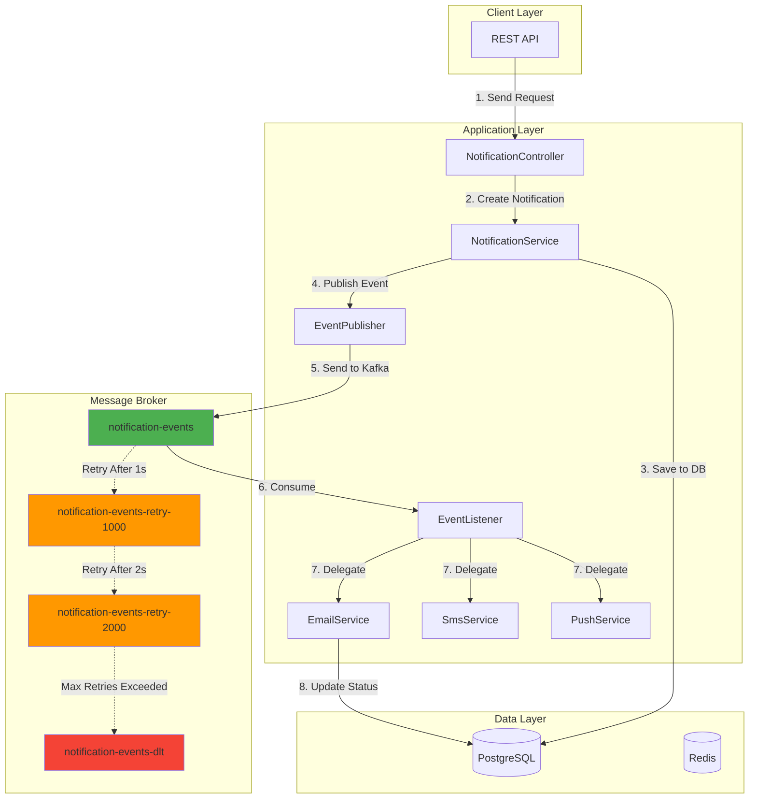

# 🚀 Notification Hub - Event-Driven Notification System

A production-ready, event-driven notification system built with **Spring Boot** and **Apache Kafka**, featuring multi-channel delivery, automatic retries with exponential backoff, Dead Letter Queue (DLQ) handling, and dynamic template management.

[](https://openjdk.java.net/)
[](https://spring.io/projects/spring-boot)
[](https://kafka.apache.org/)
[](https://www.postgresql.org/)

## 🎯 Features

- **Event-Driven Architecture**: Asynchronous notification processing using Apache Kafka
- **Multi-Channel Support**: Email, SMS, and Push notifications
- **Automatic Retry Mechanism**: Exponential backoff with configurable retry attempts
- **Dead Letter Queue (DLQ)**: Graceful handling of failed messages
- **Dynamic Templates**: Create and manage notification templates with variable substitution
- **Delivery Tracking**: Real-time status updates (PENDING → SENT/FAILED/RETRYING/DLQ)
- **Persistence**: PostgreSQL for notifications and templates
- **Scalable**: Horizontally scalable with Kafka consumer groups
- **Docker Ready**: Complete Docker Compose setup for local development

## 🏗️ Architecture



## 📊 Event Flow

1. **Request Initiation**: Client sends notification request via REST API
2. **Persistence**: Notification saved to PostgreSQL with status `PENDING`
3. **Event Publishing**: `NotificationEvent` published to `notification-events` topic
4. **Event Consumption**: Kafka listener consumes the event
5. **Channel Delegation**: Event routed to appropriate channel service (Email/SMS/Push)
6. **Delivery Attempt**: Channel service attempts to send notification
7. **Success Path**: Status updated to `SENT` in database
8. **Failure Path**: 
   - Automatic retry with exponential backoff (1s, 2s, 4s...)
   - After max retries, message moved to DLQ
   - Status updated to `FAILED` or `DLQ`

## 🛠️ Tech Stack

| Component | Technology |
|-----------|-----------|
| **Backend** | Spring Boot 3.2.3 |
| **Language** | Java 17 |
| **Message Broker** | Apache Kafka 7.5.0 |
| **Database** | PostgreSQL 15 |
| **Cache** | Redis (Alpine) |
| **Build Tool** | Maven |
| **Containerization** | Docker Compose |
| **Monitoring** | Kafdrop (Kafka UI) |

## 🚀 Quick Start

### Prerequisites
- Java 17+
- Docker & Docker Compose
- Maven 3.6+

### 1. Clone the Repository
```bash
git clone https://github.com/iam-ssrivastav/notification-hub.git
cd notification-hub
```

### 2. Start Infrastructure
```bash
docker-compose up -d
```

This starts:
- Kafka (port 9093)
- Zookeeper (port 2181)
- PostgreSQL (port 5433)
- Redis (port 6379)
- Kafdrop UI (port 9000)

### 3. Run the Application
```bash
mvn spring-boot:run
```

The application will start on `http://localhost:8080`

## 📡 API Usage

### Create a Template
```bash
curl -X POST http://localhost:8080/api/templates \
-H "Content-Type: application/json" \
-d '{
  "code": "WELCOME_EMAIL",
  "subjectTemplate": "Welcome, {name}!",
  "contentTemplate": "Hello {name}, welcome to our platform!",
  "channel": "EMAIL"
}'
```

### Send a Notification
```bash
curl -X POST http://localhost:8080/api/notifications/send \
-H "Content-Type: application/json" \
-d '{
  "recipient": "user@example.com",
  "templateCode": "WELCOME_EMAIL",
  "variables": {
    "name": "John"
  },
  "channel": "EMAIL"
}'
```

### Check Notification Status
```bash
curl http://localhost:8080/api/notifications/1
```

Check `notification-events` topic in Kafdrop to see the message flow.
